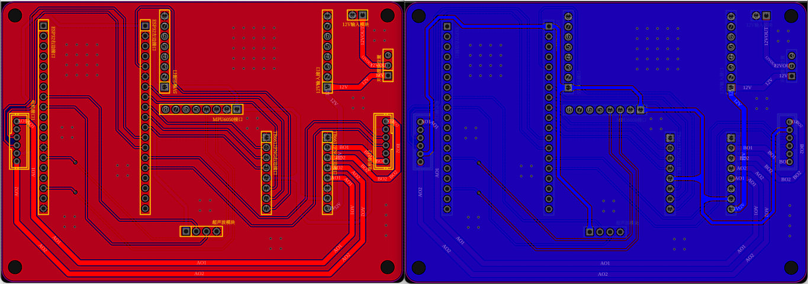

# 两轮差速平衡小车

## 简介

本项目实现了一个基于ros2通信的两轮差速平衡小车，目前只实现了小车的静态平衡，当前抖动有点大，估计参数没调好或者算法还需要改进，后面慢慢优化看吧。

- 下位机: 使用ESP32-WROOM-32E 负责实时运动控制与传感器数据采集，同时运行micro ros与上位机进行通信以及http服务与安卓软件进行通信，方便调节参数以及控制。
- 上位机: 使用ros2+Qt编写控制系统软件，实现运动控制、数据可视化以及参数设置。
- 安卓端: 使用Qt编写安卓控制系统软件，实现运动控制、数据可视化以及参数设置。

## 硬件清单

- ESP32-WROOM-32E
- MPU6050
- TB6612FNG
- JGB37-520电机（两个）
- LM2596S DC-DC 可调降压模块
- 12V 2800mAh XH插头+DC母头 锂电池电源
- 超声波测距模块（当前未用到该模块）
- M3*70 螺栓 （4根）
- 打印的 3D 模型
- PCB 打样

## 软件开发清单

- 系统：Ubuntu 22.04.5 LTS
- 电路设计软件: 嘉立创专业版
- 模型设计软件: FreeCAD
- ros2版本：humble
- 上位机Qt版本: Qt5.15.3
- 安卓软件Qt版本: Qt6.5.3
- 下位机开发环境: vscode + platformIO 插件

## 效果演示

### 实际展示效果

### 电路设计

### 3D模型装配

### 平衡车零件

### 平衡车装配

### 上位机软件界面

### 配置界面

### 安卓软件界面

